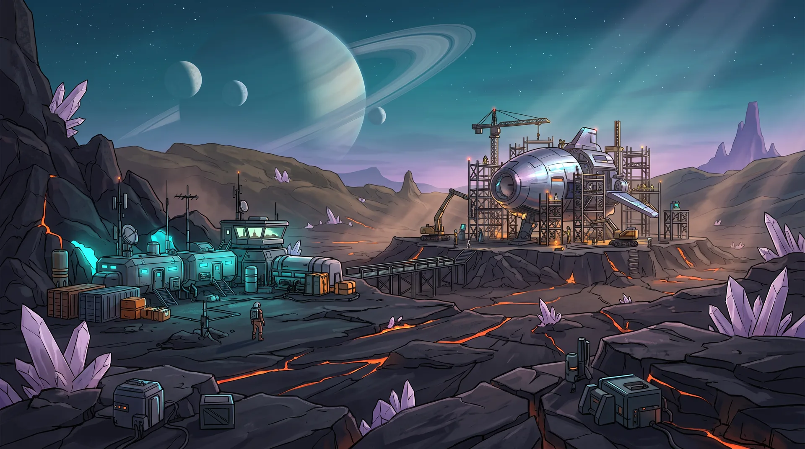

# Planet Escape

**EN** · A bilingual (English / German) sci-fi factory-building game for phones and desktop browsers. Your ship crash-landed on a dead planet. Mine ore, smelt it, assemble components and build production chains that deliver ship parts to the Landing Core – then launch and escape.

**DE** · Ein zweisprachiges (Deutsch / Englisch) Sci-Fi-Fabrik-Aufbauspiel für Handy und Desktop-Browser. Dein Schiff ist auf einem toten Planeten abgestürzt. Baue Erz ab, schmelze es, montiere Bauteile und baue Produktionsketten, die Schiffsteile zum Landekern liefern – dann starte und entkomme.



## Play / Spielen

```bash
npm install
npm run dev        # http://localhost:5173 (also reachable from your phone on the same Wi-Fi via --host)
npm run build      # production build in dist/
npm run preview    # serve the production build
```

The game is a PWA: open it in Safari on iPhone and use *Share → Add to Home Screen* for a full-screen app. Progress is saved automatically in the browser (localStorage).

A GitHub Actions workflow (`.github/workflows/deploy.yml`) deploys `dist/` to GitHub Pages on every push to `main`. Enable *Settings → Pages → Source: GitHub Actions* once in the repository.

## Story & loop

You are KORA, the ship AI. The crash left exactly one working industrial 3D printer, the *Core Printer*. Everything delivered to it becomes build material: minerals → smelt / refine → parts → depots → **print machines** → real ship parts. In story mode the seven orders are chapters on fixed maps that grow from 36×36 (iron only, no rocks) to 96×96 (everything); unlocks, upgrades and stats carry over while the factory is rebuilt each chapter. Free play is one large random map. The orders lead from the first ore to the finished ship; KORA also offers timed side contracts, four upgrade tracks (belts, drills, machines, power), dust storms that weaken solar power, and deposits that run out, so the base has to keep expanding across a 120×120 map with rock formations that force routing decisions. A scan overlay shows item flows, rates and problems; a diagnostics panel lists everything that keeps a chain from running and jumps to it.

## How it works / So funktioniert es

| Building | What it does |
| --- | --- |
| **Core Printer** | Accepts every item. Delivered items become build material; ship parts are installed on the ship, which visibly grows on the pad. |
| **Conveyor** | Moves items in the arrow direction. Drag to lay several; double-tap (or tap with the belt tool) to turn. Side-feeding belts merge. |
| **Belt tunnel** | Entrance + exit up to 4 tiles ahead: belts cross rocks and other belts underground. |
| **Miner** | Only on deposits (and deposits are reserved for miners). Passes items from behind through, so miners chain. Deposits run out. |
| **Smelter** | Ore → plates, quartz → glass. Picks the recipe from its first input. |
| **3D Printer** (2×2) | Iron plates + wire → machine parts; later steel frames + circuits → precision parts. Every higher machine costs printed parts. |
| **Assembler** (2×2) | Wire, steel frames, circuits. |
| **Refinery** (2×2) | Ice → water, oil + water → rocket fuel, quartz + water → silicon. |
| **Fabricator** (2×2) | Hull plates, engines, nav computers, fuel cells, life support. |
| **Solar panel / Fuel generator** | Power. When demand exceeds supply every machine slows down proportionally. |
| **Splitter** | Takes items from behind and distributes them left / forward / right. |
| **Sorter** (XOR) | The chosen item leaves to the left, everything else goes straight on. |
| **Overflow** (OR) | Items go straight; only when the front is blocked they spill left, then right. |
| **Mixer** (AND) | Takes from left and right and releases forward in a fixed ratio (1:1 … 3:1). |
| **Valve** | Closes while the Core holds at least N of the watched item: demand-driven production. |
| **Depot** | Buffers 120 items, passes them on at its front, optional output filter. |

Seven orders unlock buildings and recipes step by step. The last one is the ship itself:
30 hull plates, 6 engines, 4 nav computers, 14 fuel cells, 6 life-support modules.

### Tools

* **Blueprints:** ⧉ then drag a rectangle to copy buildings (with recipes and settings), tap to paste, ⟳ to rotate, 💾 to save into the blueprint library (menu).
* **Time:** ⏸ pause and ⏩ 1×/2×/3× (Space, F).
* **Throughput calculator:** open any item's production chain and pick a target rate; it lists how many miners and machines each step needs, including your upgrades and belt capacity warnings.
* **Undo:** ↶ removes the last placement or a whole belt drag (Z).
* **Save transfer:** menu → export/import as code or file to move a game between devices.

### Controls

* **Touch:** tap to place / select, drag to pan (or to lay belts when the conveyor is selected), pinch to zoom, long-press a building to select it.
* **Mouse / keyboard:** wheel to zoom, drag to pan, right-drag always pans, `R` rotate, `X` removal mode, `Esc` cancel.

## Tech

* Vite + TypeScript, no framework. Canvas 2D renderer with a DOM overlay for the UI.
* Fixed 30 Hz simulation (`src/game/sim.ts`), rendering at display refresh rate.
* Art generated with OpenArt (Nano Banana 2) from one style-anchor image, post-processed with `sharp` (`npm run assets`, sources in `tools/raw/`, not committed).
* i18n dictionary in `src/i18n/index.ts`; language is auto-detected and can be switched in the menu.

## Quality-of-life & long game / Komfort & Langzeitspiel

* **Belt line editor**: drag with the belt tool to preview an L-shaped line (count and plate cost shown), release to lay it. `Q` or the *Pipette* button copies a building as the active tool.
* **KORA speaks up**: machines starved, blocked or jammed for a while and lasting power shortages trigger a hint with a *Show* button that jumps to the spot.
* **Scan overlay** tints belts by utilisation, shows measured items/min where a belt hands over to a machine, plus rates, ore left and depot fill.
* **Research tree**: seven tracks in two tiers (belt, drill, machine, power → deposit yield, depot capacity, printer speed).
* **Chapter stars & replay**: every story chapter has a par time; stars and best times are kept on the device, any reached chapter can be replayed from the title screen.
* **Events with decisions**: meteorite (new deposit vs. salvage), buried wreck (plates vs. machine parts), solar flare (overclock the grid vs. ride out a storm).
* **Endgame score** (speed, ship parts, lean factory, contracts) with best scores; **hard mode** for free play (half the material, thinner deposits, more storms, 1.5× score).
* **Ambient soundscape**: procedural wind, drone and a factory hum that grows with activity (toggle in the menu).
* **Large maps**: pre-rendered terrain cache and low-detail rendering when zoomed out keep 160×160 maps smooth.

## MCP server: let an AI play / KI spielt mit

**Einfache Anleitung / simple guide (DE + EN): [mcp/SETUP.md](mcp/SETUP.md)**

`mcp/` contains a [Model Context Protocol](https://modelcontextprotocol.io) server that runs the game headlessly (no browser) so an AI agent such as Claude can play it, inspect the map, place buildings and let the built-in **auto-solver** design production chains.

```bash
npm run mcp:build      # bundles mcp/dist/index.mjs (esbuild)
npm run mcp:test       # drives the server over stdio: solves chapters 1-3, plans a circuit chain
npm run solver:check   # runs the auto-solver through all seven story chapters
```

Claude Desktop / Claude Code configuration (stdio transport):

```json
{
  "mcpServers": {
    "planet-escape": { "command": "node", "args": ["/absolute/path/to/PlanetEscape/mcp/dist/index.mjs"] }
  }
}
```

**Sub page for agents**: https://planet-escape.dev/ai/ explains the server, shows the tools, the playbook and a live demo where the auto-solver plays a chapter in the browser (source: `ai/index.html`, `src/ai.ts`).

**Watch the agent live**: the agent calls `pe_spectate`; the MCP server then serves a temporary spectator page on your machine (http://localhost:7411/spectate/) that renders the game live with the agent's tool calls, and paces `pe_tick` to real time while it runs. Needs `npm run build` once.

**Let an agent play a round**: the server ships a playbook (`mcp/PLAYBOOK.md`, also served by the `pe_playbook` tool and as the MCP prompt `play_chapter`) and the repo contains a Claude Code skill (`.claude/skills/play-planet-escape`). In Claude Code, after adding the server, just say "play chapter 3 of Planet Escape" or use `/play-planet-escape`; the agent starts the chapter, lets the solver build, ticks, repairs with `pe_analyze`, moves on with `pe_next_chapter` and exports the save so you can load it in the browser.

Tools (all return JSON): `pe_playbook` (agent guide), `pe_new_game` (story chapter or free play), `pe_next_chapter`, `pe_get_state`, `pe_map` (ASCII map with legend), `pe_list_buildings`, `pe_place`, `pe_remove`, `pe_configure` (rotate, recipe, filter, valve/mixer settings, contracts), `pe_route_belt` (auto-routed belt line between two buildings), `pe_build_chain` (whole production chain for an item at a target rate), `pe_solve_order` (builds everything the current KORA order needs, incl. power), `pe_tick` (advance time, stop when the order completes), `pe_analyze` (jams, starved machines, power), `pe_plan` (machine/miner counts for a rate), `pe_save` (export/import saves compatible with the browser game), `pe_spectate` (live page), `pe_chapters`.

The solver (`src/game/solver.ts`) uses Dijkstra belt routing with turn and "hugging" penalties, places machines between the consumer and their raw source, retries other spots when inputs cannot be connected, and when it runs out of plates it builds a supply chain into the core and asks the caller to tick and solve again. In `npm run solver:check` it completes chapters 1-6 unattended; the final chapter (five ship parts at once) is solved only partially and needs an agent that plans per part with `pe_build_chain`.

## Project layout

```
src/game/data.ts     items, buildings, recipes, missions, balancing constants
src/game/world.ts    terrain generation, new game state
src/game/sim.ts      belts, machines, power, missions
src/game/solver.ts   headless auto-solver (belt routing, chain building) used by the MCP server
mcp/src/index.ts     MCP server exposing the game to AI agents
src/game/render.ts   canvas rendering (belts are drawn procedurally)
src/game/input.ts    touch / mouse / keyboard handling
src/ui/hud.ts        title screen, HUD, info panel, modals
tools/process-assets.mjs  raw OpenArt renders -> optimized webp sprites
```
